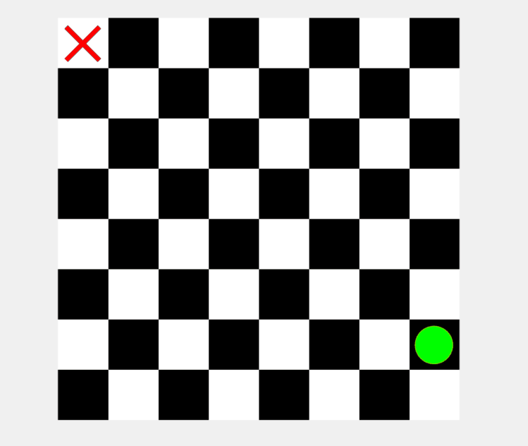

# Rooster Chase Game in MATLAB

This project implements the classic "Rooster Chase" game using an 8×8 chessboard grid in MATLAB. In this game, a farmer tries to capture a rooster by moving on the board according to a strategy based on distance calculations. The farmer uses a greedy algorithm to minimize the distance between them, pushing the rooster into a corner for capture.

### Features:
- A grid-based representation of the game using a chessboard.
- Farmer movement based on Manhattan distance calculations.
- Rooster movement is randomly.
- Capture logic ensures the game ends within a maximum of 14 moves.
- Visualization of the game board and moves.

### How it Works:
- The rooster starts by moving first.
- The farmer then moves to minimize the maximum distance (either in rows or columns) between them.
- The game continues until the farmer catches the rooster in a corner.

### How to Run:
1. Clone the repository.
2. Open the `Main.m` file in MATLAB.
3. Run the script to see the game in action.

<table>
  <tr>
    <td></td>
  </tr>
</table>
